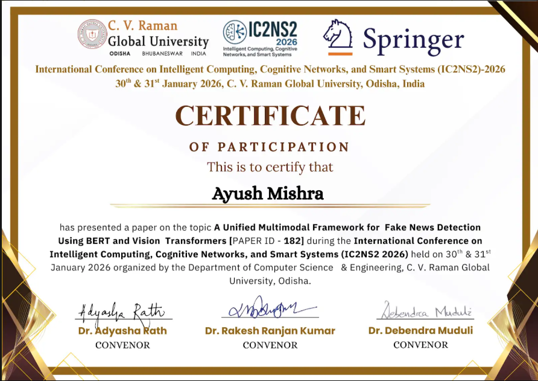

# Multimodal Fake News Detection using BERT and Vision Transformers

This repository contains the research work presented at the
**International Conference on Intelligent Computing, Cognitive Networks,
and Smart Systems (IC2NS2 2026)**.

The project proposes a **multimodal fake news detection framework** that
jointly analyzes textual and visual content using transformer-based
architectures.

The system integrates **BERT--BiGRU for textual representation
learning** and a **Vision Transformer (ViT-B/16) for visual
understanding**, combined through a lightweight **feature concatenation
fusion strategy** for multimodal decision making.

------------------------------------------------------------------------

## 📄 Research Work

**Title:**\
*A Unified Multimodal Framework for Fake News Detection Using BERT and
Vision Transformers*

**Authors:**\
Ayush Mishra, Naveen Kumar

**Institution:**\
Sardar Vallabhbhai National Institute of Technology (SVNIT), Surat,
India

**Conference:**\
International Conference on Intelligent Computing, Cognitive Networks,
and Smart Systems (**IC2NS2 2026**)

**Status:**\
Paper **presented at the conference**. The final published version will
be added to this repository once available.

------------------------------------------------------------------------

## 🧠 Research Motivation

The rapid spread of misinformation on social media platforms requires
systems capable of analyzing **multiple modalities simultaneously**.

Traditional fake news detection models rely only on **textual signals**,
making them ineffective when misleading content combines **manipulated
images and deceptive text**.

This research explores a **multimodal transformer-based framework**
capable of capturing semantic inconsistencies between textual narratives
and associated visual content.

------------------------------------------------------------------------

## 🏗 Model Architecture

The proposed system follows a **dual‑encoder multimodal architecture**.

### Text Processing

Text → **BERT** → **BiGRU** → Text Feature Representation

-   **BERT** extracts contextual semantic embeddings
-   **BiGRU** models sequential narrative patterns in text

### Image Processing

Image → **Vision Transformer (ViT‑B/16)** → Visual Feature
Representation

-   Captures global contextual relationships in images
-   Effective for detecting visual inconsistencies in fake news

### Multimodal Fusion

Text Features + Image Features\
↓\
Feature Concatenation\
↓\
Fully Connected Layer\
↓\
Fake / Real Classification

------------------------------------------------------------------------

## 📊 Dataset

**Fakeddit Dataset**

Fakeddit is a large-scale multimodal dataset containing:

-   Reddit posts
-   Associated images
-   Labels indicating misinformation

The dataset allows models to analyze both **textual and visual signals**
to detect fake news.

------------------------------------------------------------------------

## 📈 Experimental Results

  Metric      Score
  ----------- ------------
  Accuracy    **90.18%**
  Precision   0.90
  Recall      0.90
  F1 Score    0.90

The results demonstrate that **strong modality‑specific encoders
combined with a simple fusion strategy can achieve robust performance
without complex cross‑modal attention mechanisms.**

------------------------------------------------------------------------

## ⚙️ Technology Stack

-   Python\
-   PyTorch\
-   HuggingFace Transformers\
-   Vision Transformer (ViT)\
-   BERT\
-   BiGRU\
-   Multimodal Deep Learning

------------------------------------------------------------------------

## 🎤 Conference Presentation

This research was presented at:

**International Conference on Intelligent Computing, Cognitive Networks,
and Smart Systems (IC2NS2 2026)**\
C. V. Raman Global University, Odisha, India\
January 30--31, 2026

------------------------------------------------------------------------

## 🔗 Research Announcement

LinkedIn Post:\
https://www.linkedin.com/posts/ayush190511_machinelearning-datascience-multimodalai-activity-7426841200848113664-4lDd

------------------------------------------------------------------------

## 👨‍💻 Author

**Ayush Mishra**\
M.Tech -- Data Science\
Sardar Vallabhbhai National Institute of Technology (SVNIT), Surat

LinkedIn:\
https://linkedin.com/in/ayush190511

------------------------------------------------------------------------

## ⭐ Citation

If you reference this work, please cite:

Mishra, A., Kumar, N. (2026).\
*A Unified Multimodal Framework for Fake News Detection Using BERT and
Vision Transformers.*\
Presented at IC2NS2 2026.
